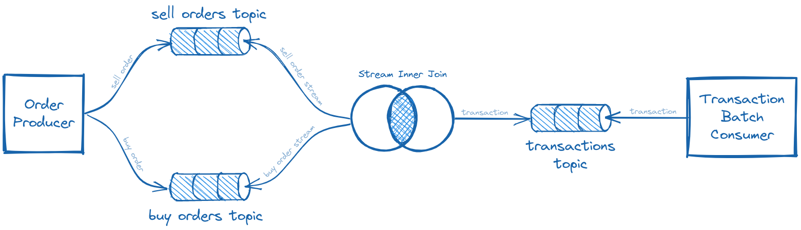

# Apache Kafka in the era of Java Microframeworks

This project is intended as a showcase of Apache Kafka integration using four different Java frameworks. It can serve as
a guideline for choosing the framework of your next project.

The four frameworks being compared here are:

* Spring Boot
* Micronaut
* Quarkus
* Javalin

TODO

## Architecture

TODO

## Launching & testing

You can easily test each of these projects, as there are only two requirements: having _docker_ and _docker-compose_
installed. Everything is orchestrated using docker-compose through [docker-compose.yml](docker-compose.yml) file. 
Inside you'll find 8 services:

| Service    | Exposed Port                    | Desc                                                                        |
|------------|---------------------------------|-----------------------------------------------------------------------------|
| zookeeper  | 2181                            | Zookeeper, used to orchestrate Kafka cluster                                |
| kafka      | 9002                            | Kafka itself                                                                |
| kouncil    | [8080](http://localhost:8080)   | Web based Kafka dashboard, allowing you to see what's going on inside Kafka |
| netdata    | [19999](http://localhost:19999) | System monitoring tool                                                      |
| springboot | 8081                            | Spring Boot application, running on JVM                                     |
| micronaut  | 8082                            | Micronaut application, running on JVM                                       |
| quarkus    | 8083                            | Quarkus application, running as native image                                |
| javalin    | 8084                            | Javalin application, running on JVM                                         |

### Building docker images

To build docker images simply run

    docker-compose build

Java source codes will be compiled inside docker containers, using multistage build process. Resulting images 
contain only runtime components, without sources, build tools etc. This step may take a couple of minutes, depending 
on your CPU and internet connection. 

### Launching

After everything has been successfully built, you can start Kafka and applications by typing:

    docker-compose up -d

This will spawn docker containers - you should see 8 services marked as `done`. 

    Creating kafka-microframeworks_zookeeper_1 ... done
    Creating kafka-microframeworks_netdata_1   ... done
    Creating kafka-microframeworks_kafka_1     ... done
    Creating kafka-microframeworks_kouncil_1   ... done
    Creating quarkus                           ... done
    Creating micronaut                         ... done
    Creating spring-boot                       ... done
    Creating javalin                           ... done

At any point in time you can make sure that everything is ok by checking the output of `ps` command, like so:

    docker-compose ps

You should see 8 services, each one of them with `Up` State.

Head to [http://localhost:8080](http://localhost:8080), you'll find Kouncil there, which is a web dashboard for 
Apache Kafka. You should see topics starting with `spring-boot`, `micronaut`, `quarkus`, and `javalin` prefixes. 
Feel free to inspect them, they should all be empty.

### Testing

Testing is fairly easy, as it only requires any kind of HTTP client, like curl or postman. Each of the applications 
expose  HTTP POST endpoint `/order/{count}`, which generates `{count}` random Buy and Sell Orders.

Here are example curls to generate 1000 random Buy and Sell Orders in each of the applications:

| Application | curl                                          |
|-------------|-----------------------------------------------|
| Spring Boot | curl -X POST http://localhost:8081/order/1000 |
| Micronaut   | curl -X POST http://localhost:8082/order/1000 |
| Quarkus     | curl -X POST http://localhost:8083/order/1000 |
| Javalin     | curl -X POST http://localhost:8084/order/1000 |

You can actually generate hundreds of millions of Orders, and everything should be fine, as long as you have sufficient 
disk space.

After generating some Orders head to Kouncil ([http://localhost:8080](http://localhost:8080)) and inspect input 
topics of one the applications, let's say `quarkus-sell-orders` and `quarkus-buy-orders`. You should see some random 
Orders. From there, head to corresponding transactions topic (`quarkus-transactions` in this case), and you should 
expect some Transaction objects to be there, as a result of stream join.

While the applications are running, you can monitor resource consumption using Netdata, which should be running at 
[http://localhost:19999](http://localhost:19999)
